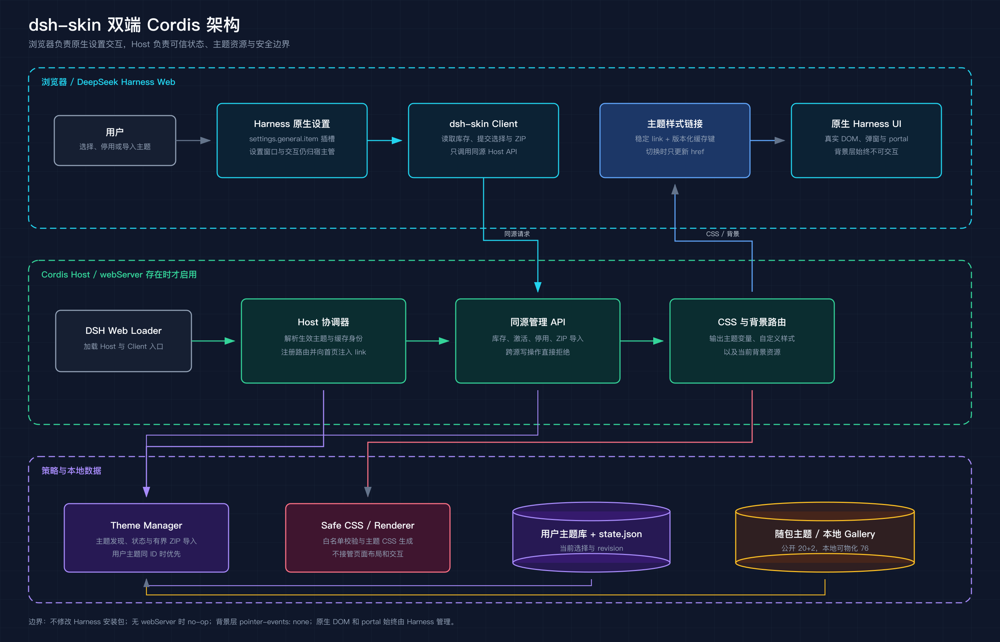
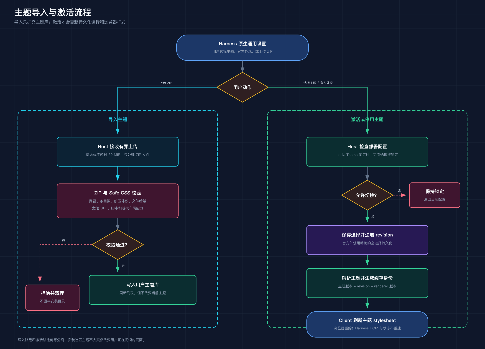

# 把 Codex Dream Skin 搬进 DeepSeek Harness

第一次做 dsh-skin 时，我把它想简单了。

换几个颜色，铺一张背景图，再做个主题选择器，似乎就够了。第一版也确实很快跑了起来：页面上有一个浮动按钮，点开是插件自己的设置页，能导入主题，也能切换。

问题是，它怎么看都像外挂在 Harness 旁边的小工具。用户真正想要的很直接：皮肤就该在原来的设置里，不要再造一个入口。

后面的开发，基本都在解决这句话带来的问题。

## 先把插件放回宿主的架构里

Codex Dream Skin 原本服务于桌面客户端，历史方案里有 Chrome 扩展、CDP 和 Electron 注入。DeepSeek Harness 已经有 Cordis 插件系统，照搬这些能力只会绕远路，还可能让插件在 headless、ACP 等没有网页的模式里误启动。

dsh-skin 最后被拆成了两半。

浏览器端很薄，只在 Harness 原生“皮肤库”里注册一个设置页，负责展示主题图片预览、提交选择和上传 ZIP。设置窗口、国际化、组件销毁仍由 Harness 管。

Host 端负责可信操作：读取主题库，保存当前选择，校验 ZIP 和自定义 CSS，生成主题样式，提供背景资源。没有 webServer 时，这部分不会加载。

这个拆分解决了早期版本最别扭的地方。插件不再猜页面 DOM、塞浮动按钮，也不拥有独立设置路由。命令行和网页设置共用同一份本地状态，不会各记各的主题。

页面里始终只有一条由插件管理的主题样式链接。主题变化时更新链接地址，Harness 自己的 React 页面不用重建。输入框、会话、菜单和弹窗还是原来的 DOM，插件只改变视觉层。

## 一次导入和切换是怎么生效的

导入与激活是两条独立路径。这是故意的。

用户导入 ZIP 后，Host 会检查请求体大小、压缩条目、解压体积、路径、文件哈希和 Safe CSS。通过后，主题只进入本地库并出现在列表里，不会突然改变用户正在看的页面。失败则清理临时目录，不留下半安装状态。

用户明确选择某个主题时，Host 才会保存选择、递增状态修订号，并生成新的缓存身份。浏览器端拿到新地址后刷新样式链接，背景和颜色立即更新。

这里有一个容易漏掉的状态语义：“官方外观”和“从未选过主题”不是一回事。

如果只把两者都记成空值，配置里的默认主题会在下次启动时补回来，用户刚点的停用就像失效了一样。现在的规则是：部署方固定的主题优先；否则尊重用户保存的选择，包括明确停用；只有用户从未保存过选择时，默认主题才生效。

缓存键也不能只放主题名称和版本。同一主题的生成规则更新后，浏览器仍可能命中旧 CSS。后来缓存身份里加入了状态修订号和渲染器版本，规则变化时旧缓存会自然失效。

## 最难缠的不是颜色，是 CSS 层级

带图主题第一次“成功加载”时，页面上其实什么也看不到。

早期样式把背景指向一个不存在的节点。资源请求是成功的，背景却没有渲染目标。后来改成由 body 的伪元素绘制，背景层固定不可交互，不需要往页面里再插一个真实节点。

紧接着又踩了层级坑。背景放得太低，会掉到页面画布后面；为了抬高界面给根节点加层级，又会创建新的堆叠上下文，让 Harness 的弹窗被右侧资源面板盖住。

最后的做法反而更少：让背景待在 body 的隔离层里，不碰根节点的层级。弹窗和 portal 的顺序继续由 Harness 决定。

还有一次，设置窗口被压成大约 55 像素宽，中文一字一行。坏掉的是弹窗，原因却在侧栏。主题给导航祖先加了背景滤镜，滤镜改变了定位包含块，官方 overlay 只能拿到侧栏那一点宽度。移除导航祖先上的滤镜后，设置窗口恢复到 800 像素。

这类问题靠看一张主题预览图很难发现。必须打开真实设置、菜单、长会话和资源面板，让宿主的各种层级同时出现。

## Safe CSS 不能只顾着“Safe”

社区主题可以带自定义 CSS，插件不可能照单全收。脚本表达式、外部导入、危险 URL、固定定位和任意布局覆盖都会被拒绝；字号、间距和圆角即使允许，也有范围限制。

但白名单太紧，同样会出问题。

Rei 蓝铅素描主题第一次导入失败，ZIP、哈希和目录结构都正常。真正的原因是它使用了 DreamSkin 允许的边框长属性和过渡属性，而插件当时只接受简写属性。

修复时没有把白名单整体放宽，而是对照上游主题合同，只补入有明确边界的视觉属性。这个例子挺典型：安全校验不只是拦恶意内容，还要分清“危险”和“目前没见过”。

ZIP 导入也做了类似处理。路径穿越、重复路径、文件数量、压缩前后体积和清单哈希都要检查。导入失败时无论在哪一步退出，临时目录都要清掉。早期重复导入就漏过这件事，报错之后磁盘上还留着解压目录。

## 热门前 100，把自动修色做崩了

只测两三套主题时，很多问题都藏得住。Gallery 热门前 100 跑起来后，情况一下具体了：100 个包的哈希都正确，93 个能严格导入，另外 7 个缺少非空主题样式文件，官方元数据也把它们标为不兼容。

第一轮可读性优化很“有效”。插件提高玻璃面板的不透明度，还会根据壁纸亮度改文字和强调色。对比度数据上去了，主题也越来越像同一套模板。

用户看完只说了一句：太丑了，原来的效果几乎全丢了。

于是这套全局修色被撤回。正文颜色、强调色和玻璃透明度重新交给主题作者。插件只修语义明确的不透明区域，比如代码块、行内代码、菜单和按钮；侧栏那个看不清的细线展开图标，也只做了定点调整。

源质量确实差的主题不再强救。24 套原始对比度不合格的主题从默认库移除，5 套纯色主题也被删掉，最终保留 76 套本地 Gallery 主题。

E2E 没再用空页面凑数。测试切换了 3 条真实会话，其中一条接近一万字，然后逐个激活 76 套主题，检查背景、输入框、滚动、原生控件和横向溢出。76 套全部通过后，再把用户原来的主题恢复。

## 100 套审计，公开包只放指定的 19 套

Gallery 热门前 100 解压后有两百多兆，许可证也不统一。有些主题限制再分发，有些只允许个人使用，还有一些素材来源说不清。全塞进 MIT 项目发布，风险比功能收益大得多。

现在本地工具可以物化审计后保留的 76 套主题，公开包只带维护者指定的 15 套 Gallery 主题和 4 套项目主题。发布清单逐目录列白名单，测试会核对实际打包内容、来源记录和图片预算，避免开发机多出一个目录就被顺手发布。

第一次交付包大约 57.3 MB，慢速下载时直接超时。后来 20 张背景图在不裁切、不调色的前提下转成高质量 WebP，包体降到约 6.46 MB。压缩后的主题又跑了一遍浏览器检查，确认没有拿明显失真换体积。

发布阶段还有个很普通的错误：项目版本已经改成 0.3.0，但远端没有同名 Git 标签。按版本安装当然找不到提交。日志末尾那条构建权限提示只是通用文案，真正的失败发生在标签解析阶段。补齐标签并重新做隔离安装后，发布链路才算结束。

## 写在最后

dsh-skin 的核心代码不算庞大，麻烦都在边界上：浏览器端和 Host 谁负责什么，背景应该放在哪一层，主题 CSS 能碰到哪里，可读性要修到什么程度，哪些素材可以测试却不能发布。

最开始我觉得背景图出来、按钮能点，插件就完成了。后来才知道，真正的完成标准是主题生效以后，Harness 还像 Harness。
